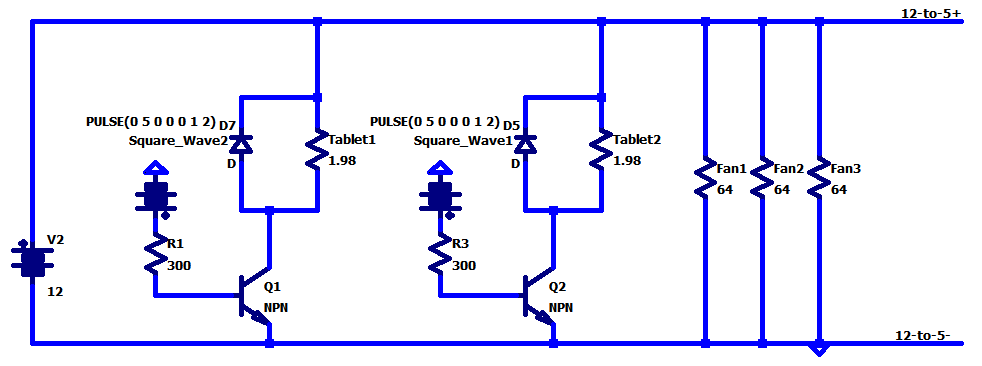
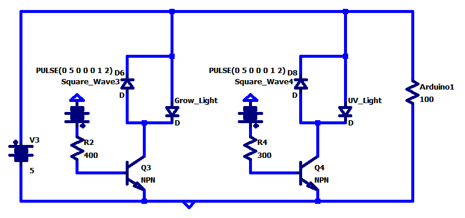

# Hydroplant Terrarium

##Overview
This product is to aim to help grow plants and mushrooms in urban locations, With a lack of space and an ill environment for personal plants and mushrooms to grow, it's a topical problem. The following is my contribution.

The aim of my contribution of the project is to provide electric power to everything that requires it that doesn't have a source of power from the wall, thus I was required to power grow lights, UV lights, refrigeration cooling tablets, and server fans to cool down the refrigeration tablets. Since we wanted to have addressible lighting that wanted timings and variable amoutns of time to turn on the refrigeration tablets, they need power transistors that hook up to an Arduino. 

##How it Works

Most power sources are hooked up in parallel, thus we chose to power everything in parallel as well. Through research, we found that through this transistor circuit, we can power these lights and cooling tablets with a PWM response in conjunction with a temperature sensor and a clock to control these components.

[A more detailed explanation can be found here](https://docs.google.com/document/d/1kqgNW-pK1zlMfikjJWIcdxYDao5X0wYXam6Ozh2JYHs/edit?usp=sharing)
